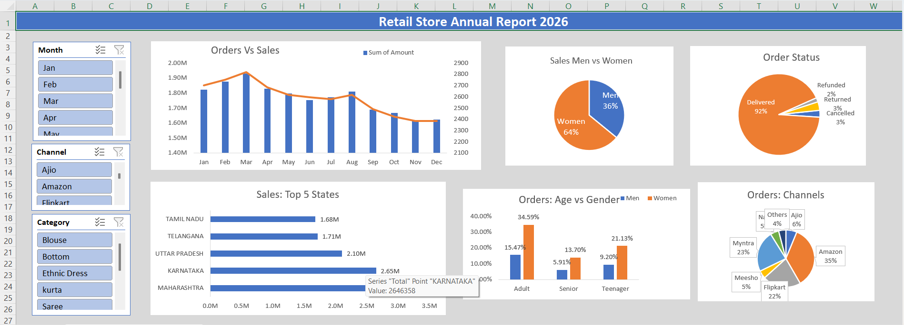

# Retail Sales Performance Analysis

## Project Overview

This project analyzes retail sales data using Microsoft Excel to identify sales trends, customer behavior, product performance, and key business insights.

## Tools Used

- Microsoft Excel
- Pivot Tables
- Pivot Charts
- Interactive Dashboard
- Data Cleaning and Analysis

## Project Objectives

- Analyze overall sales performance
- Identify monthly sales trends
- Analyze sales by product category
- Identify top-performing products
- Understand customer purchasing patterns
- Generate actionable business insights

## Dashboard

The interactive dashboard provides a visual overview of key sales metrics and performance indicators.

## Key Insights

-	Women are more likely to buy compared to men (~65%)
- Maharashtra, Karnataka and Uttar Pradesh are the top 3 states (~50%)
-	Adult age group (30-49 yrs) is max contributing (~50%)
- Amazon, Flipkart and Myntra channels are max contributing (~80%)

## Files Included

- `Retail_Sales_Performance_Analysis.xlsx` – Contains raw data, Pivot Tables, Pivot Charts, and the interactive dashboard.
- `Retail_Sales_Key_Insights.docx` – Contains the key insights derived from the analysis.
- `Dashboard_Screenshot.png` – Preview of the interactive Excel dashboard.

## Conclusion

The analysis provides insights into sales performance, customer behavior, and product trends, helping identify areas of improvement and opportunities for better business decision-making. The findings suggest that targeting women customers of age group (30-49 yrs) living in Maharashtra, Karnataka and Uttar Pradesh by showing ads/offers/coupons available on Amazon, Flipkart and Myntra could improve customer engagements and sales performance.
